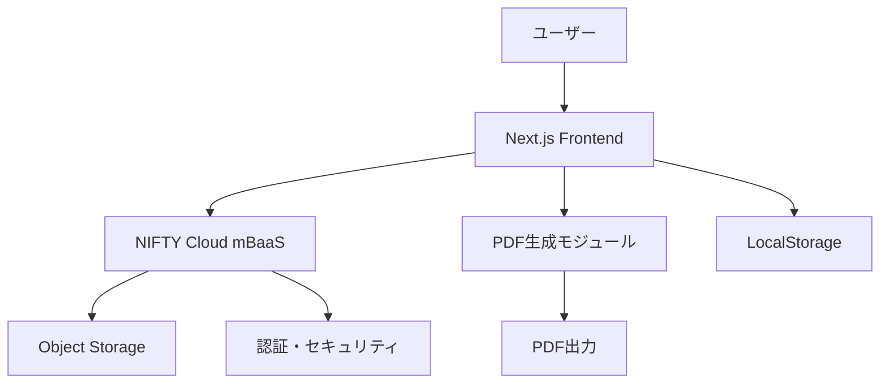

# 📋 LP制作見積アプリ 設計仕様書

<!-- 最終更新: 2025-10-31 02:40 -->
<!-- 変更履歴: 2025-10-31 - ヒアリングシートUI拡充（視認性・操作性向上）を追記 -->
<!-- 変更履歴: 2024-12-19 - 初版作成（要件定義書3ファイルを統合） -->

## 📖 目次
1. [プロジェクト概要](#1-プロジェクト概要)
2. [システムアーキテクチャ](#2-システムアーキテクチャ)
3. [機能設計](#3-機能設計)
4. [データベース設計](#4-データベース設計)
5. [UI/UX設計](#5-uiux設計)
6. [技術仕様](#6-技術仕様)
7. [セキュリティ設計](#7-セキュリティ設計)
8. [実装計画](#8-実装計画)
9. [テスト計画](#9-テスト計画)
10. [運用・保守](#10-運用保守)

---

## 1. プロジェクト概要

### 1.1 プロジェクト名
**LP制作見積アプリ（NIFTY × Next.js）**

### 1.2 目的
フリーランスや小規模制作会社がクライアントへの見積書を迅速かつ正確に作成できる、**LP制作の自動見積Webアプリケーション**を開発する。Excelでの手動計算をWeb化し、ヒアリング・見積・PDF出力までをワンストップで実現する。

### 1.3 コンセプト
> 「表計算不要。誰でも1分でLP見積を出せるWebアプリ」

- フリーランスや小規模制作会社がクライアント見積を迅速に作成
- 価格構成やオプションを可視化し、単価感の透明性を保つ
- データはNIFTY Cloud（無料枠）に保存し、ログイン不要・匿名利用可

### 1.4 背景・課題
従来のLP制作見積は以下の課題があった：
- エクセルやPDFでの手作業による非効率性
- クライアントとの調整に時間がかかる
- 見積単価の標準化が困難
- ヒアリング内容と見積の連携が不十分

### 1.5 期待効果
- 制作者の**見積業務の自動化**による作業効率化
- 見積単価の**標準化・可視化**による信頼性向上
- NIFTY Cloud活用による**完全無料の運用**を実現
- フリーランス支援ツールとしての信頼性・拡散性を強化

---

## 2. システムアーキテクチャ

### 2.1 全体構成図


### 2.2 技術スタック
| カテゴリ | 技術 | バージョン | 用途 |
|----------|------|------------|------|
| フロントエンド | Next.js | 14.x | App Router使用 |
| フロントエンド | React | 18.x | UI構築 |
| フロントエンド | TypeScript | 5.x | 型安全性確保 |
| スタイリング | TailwindCSS | 3.x | スタイリング |
| UIコンポーネント | shadcn/ui | Latest | 再利用可能コンポーネント |
| アニメーション | Framer Motion | 10.x | インタラクション |
| 状態管理 | Zustand | 4.x | グローバル状態管理 |
| フォーム管理 | React Hook Form | 7.x | フォーム処理 |
| バックエンド | NIFTY Cloud mBaaS | - | API・認証・ストレージ |
| ストレージ | NIFTY Object Storage | - | JSONデータ保存 |
| PDF生成 | react-pdf | 7.x | PDF出力 |
| ホスティング | Vercel | - | デプロイ・CDN |
| バージョン管理 | GitHub | - | ソースコード管理 |

### 2.3 システム構成詳細
```
[ユーザー] 
    ↓ HTTPS
[Vercel CDN] 
    ↓
[Next.js App Router]
    ├── 静的生成（SSG）
    ├── サーバーサイドレンダリング（SSR）
    └── クライアントサイドレンダリング（CSR）
    ↓
[NIFTY Cloud mBaaS API]
    ├── 認証・認可
    ├── データ保存・取得
    └── ファイルアップロード
    ↓
[NIFTY Object Storage]
    └── JSON形式データ保存
```

---

## 3. 機能設計

### 3.1 機能一覧
| 機能ID | 機能名 | 概要 | 優先度 |
|--------|--------|------|--------|
| F001 | トップページ | 技術アピール兼ランディングページ | 高 |
| F002 | ヒアリングシート | 案件情報入力フォーム | 高 |
| F003 | 見積計算 | 自動価格計算機能 | 高 |
| F004 | 見積プレビュー | 見積内容の表示・確認 | 高 |
| F005 | PDF出力 | 見積書のPDF生成・ダウンロード | 高 |
| F006 | データ保存 | NIFTY Cloudへの保存 | 中 |
| F007 | データ共有 | 共有リンク生成 | 中 |
| F008 | レスポンシブ対応 | モバイル・タブレット対応 | 高 |

### 3.2 詳細機能仕様

#### F001: トップページ
**目的**: アプリの信頼性と開発者スキルを訴求するポートフォリオ型ランディングページ

| セクション | 内容 | 技術実装 |
|------------|------|----------|
| ヒーローエリア | 「Next.js × NIFTY × LP Estimate」キャッチコピー＋CTAボタン | Framer Motionアニメーション |
| 機能紹介 | 見積・ヒアリング・PDF出力をカード形式で紹介 | shadcn/ui Cardコンポーネント |
| 技術紹介 | Next.js, Tailwind, NIFTY Cloud連携を図解で説明 | インタラクティブな図解 |
| 開発者プロフィール | 開発者名、GitHub、SNSリンク表示 | ソーシャルリンク統合 |
| コンタクトフォーム | フォーム送信 or メールリンク | React Hook Form |

**技術要件**:
- Lighthouse 90点以上を目標
- SEO対応済み構造化データ出力
- パフォーマンス最適化（画像遅延読み込み等）

#### F002: ヒアリングシート
**目的**: クライアントとのやり取りをスムーズにする案件情報収集フォーム

| カテゴリ | 質問内容 | 入力形式 | バリデーション |
|----------|----------|----------|----------------|
| 基本情報 | 会社名/担当者/連絡先/所在地/業種/従業員数 | テキスト＋選択 | 必須/形式/上限 |
| 目的・種別 | 目的（複選）/サイト種別（必須） | チェック＋ラジオ | 目的1つ以上/種別必須 |
| 構成 | 想定ページ数/構成要望 | ラジオ＋テキスト | ページ範囲チェック |
| ターゲット | 性別/年齢層/属性 | チェック＋テキスト | 文字数上限 |
| ブランド | イメージ/価値観/目指す姿 | チェック | 任意 |
| 競合 | 良い点/改善点/URL | チェック＋URL | URL形式 |
| 予算・納期 | 金額・確度/希望納期 | 数値＋選択 | 必須 |
| 現状サイト | 有無/URL/課題 | ラジオ＋チェック | URL形式 |
| デザイン | テイスト/カラー/ロゴ/画像素材/不足時対応 | チェック＋テキスト | 任意 |
| 機能要件 | 基本/高度/CMS/更新頻度 | チェック＋選択 | 任意 |
| SEO・マーケ | 重要度/KW/現行施策/SNS/GA4 | チェック＋テキスト | 任意 |
| 技術・インフラ | ドメイン/サーバ/SSL/デバイス | ラジオ＋チェック | 任意 |
| 保守・運用 | 保守契約/バックアップ/セキュリティ | ラジオ＋選択 | 任意 |
| 進行・その他 | 決裁/過去経験/重視点/特記事項 | ラジオ＋チェック＋テキスト | 任意 |

**技術実装**:
- React Hook Formによる入力管理
- Zustandで状態共有
- LocalStorageに自動保存（ブラウザ再読込時に保持）
- リアルタイムバリデーション
- モバイル優先の段組（見出し固定・セクション折りたたみ・ステッパー表示）
- 分岐表示（CMS希望時に更新頻度/運用導線を表示、EC選択時に決済/返品/特商法を表示）

#### F003: 見積計算
**目的**: ヒアリング内容に基づく自動価格計算

**計算式**:
```
合計金額 = LP基本料金 + (下層ページ数 × 単価) + (機能単価 × 数量)
```

**基本料金体系**:
| 項目 | 料金 | 備考 |
|------|------|------|
| LP（1ページ・静的HTML） | 80,000円 | デザイン＋コーディング |
| レスポンシブ対応 | +15,000円 | スマホ最適化 |
| フォーム（メール送信） | +15,000円 | お問い合わせフォーム |
| アニメーション | +10,000円 | CSS/JS演出 |
| WordPress化 | +25,000円 | 更新可能化 |
| 原稿作成 | +20,000円 | CTA文・説明文作成 |

**オプション料金**:
| 機能 | 料金 | 備考 |
|------|------|------|
| お問い合わせフォーム | +15,000円 | PHP or Googleフォーム連携 |
| 予約フォーム | +30,000円 | カレンダー連携 |
| ブログ機能 | +25,000円 | WP投稿対応 |
| 管理画面構築 | +40,000円 | CMS管理機能 |
| スライダー／カルーセル | +8,000円 | Swiper.js対応 |
| FAQアコーディオン | +5,000円 | JS実装 |
| SEO内部対策 | +15,000円 | 構造化データ含む |
| GA4／Search Console設定 | +8,000円 | 分析設定 |
| SNS連携 | +8,000円 | OGP／Instagramなど |
| 多言語対応 | +40,000円／言語 | JSON翻訳対応 |
| サーバー・ドメイン取得代行 | +8,000円 | 実費別途 |
| 月次保守 | 月10,000円 | 軽微修正・バックアップ |

**技術実装**:
- リアルタイム計算（入力変更時に即座に反映）
- 税込・税抜切替機能
- 計算履歴の保存

#### F004: 見積プレビュー
**目的**: 見積内容の視覚的確認と編集

| 要素 | 内容 | 技術実装 |
|------|------|----------|
| 見積表 | 項目・単価・数量・小計・合計の表形式表示 | shadcn/ui Table |
| 内訳詳細 | 各項目の詳細説明 | アコーディオン表示 |
| 編集機能 | 数量・単価の直接編集 | インライン編集 |
| 税計算 | 税込・税抜の自動計算 | リアルタイム更新 |

#### F005: PDF出力
**目的**: 見積書のPDF生成・ダウンロード・印刷

| 機能 | 内容 | 技術実装 |
|------|------|----------|
| PDF生成 | react-pdfを使用したPDF生成 | react-pdf |
| レイアウト | A4横レイアウトで出力 | カスタムレイアウト |
| ダウンロード | ブラウザからPDFダウンロード | Blob生成 |
| 印刷 | ブラウザの印刷機能 | window.print() |

---

## 4. データベース設計

### 4.1 データ構造（NIFTY Object Storage）
```json
{
  "id": "uuid-string",
  "createdAt": "2024-12-19T15:30:00Z",
  "updatedAt": "2024-12-19T15:30:00Z",
  "hearingData": {
    "sitePurpose": ["集客", "採用"],
    "serviceOverview": "ECサイト制作",
    "targetAudience": "20-40代女性",
    "contentStructure": {
      "type": "LP",
      "pageCount": 1
    },
    "features": ["フォーム", "SEO"],
    "designDirection": ["シンプル", "高級感"],
    "referenceSites": ["https://example.com"],
    "colorScheme": "#FF6B6B",
    "deliveryDate": "2024-12-31",
    "budgetRange": "10-20万円",
    "serverDomain": "取得希望",
    "materialProvision": ["画像提供", "原稿提供"],
    "maintenance": {
      "required": true,
      "comment": "月次更新希望"
    }
  },
  "estimateData": {
    "basicPrice": 80000,
    "additionalPages": 0,
    "options": [
      {
        "name": "レスポンシブ対応",
        "price": 15000,
        "quantity": 1
      }
    ],
    "subtotal": 95000,
    "tax": 9500,
    "total": 104500
  },
  "metadata": {
    "version": "1.0.0",
    "userAgent": "Mozilla/5.0...",
    "ipAddress": "192.168.1.1"
  }
}
```

### 4.2 データフロー
1. **入力段階**: LocalStorageに一時保存
2. **計算段階**: メモリ上でリアルタイム計算
3. **保存段階**: NIFTY Cloud Object Storageに永続化
4. **共有段階**: 署名付きURLでアクセス制御

---

## 5. UI/UX設計

### 5.1 デザインシステム
| 要素 | 仕様 | 実装 |
|------|------|------|
| カラーパレット | プライマリ: #3B82F6, セカンダリ: #10B981 | TailwindCSS |
| タイポグラフィ | Inter, Noto Sans JP | Google Fonts |
| スペーシング | 4px基準の8pxグリッド | Tailwind spacing |
| ボーダー半径 | 4px, 8px, 12px | 統一されたradius |
| シャドウ | 3段階のelevation | shadcn/ui準拠 |

### 5.2 レスポンシブ設計
| ブレークポイント | デバイス | レイアウト |
|------------------|----------|----------|
| 320px-768px | モバイル | 1カラム、縦スクロール |
| 768px-1024px | タブレット | 2カラム、サイドバー |
| 1024px+ | デスクトップ | 3カラム、フルレイアウト |

### 5.3 コンポーネント設計
```
components/
├── ui/                 # shadcn/uiベースコンポーネント
│   ├── button.tsx
│   ├── input.tsx
│   ├── card.tsx
│   └── table.tsx
├── forms/              # フォーム関連
│   ├── HearingForm.tsx
│   └── EstimateForm.tsx
├── layout/             # レイアウト
│   ├── Header.tsx
│   ├── Sidebar.tsx
│   └── Footer.tsx
└── features/           # 機能別コンポーネント
    ├── EstimateCalculator.tsx
    ├── PDFGenerator.tsx
    └── DataSaver.tsx
```

---

## 6. 技術仕様

### 6.1 パフォーマンス要件
| 項目 | 要件 | 測定方法 |
|------|------|----------|
| ページロード時間 | 2秒以内 | Lighthouse |
| First Contentful Paint | 1.5秒以内 | Web Vitals |
| Largest Contentful Paint | 2.5秒以内 | Web Vitals |
| Cumulative Layout Shift | 0.1以下 | Web Vitals |
| Time to Interactive | 3秒以内 | Web Vitals |

### 6.2 セキュリティ要件
| 項目 | 要件 | 実装方法 |
|------|------|----------|
| HTTPS通信 | 必須 | Vercel自動設定 |
| 入力値検証 | クライアント・サーバー両方 | React Hook Form + Zod |
| XSS対策 | 必須 | Reactの自動エスケープ |
| CSRF対策 | 必須 | SameSite Cookie |
| データ暗号化 | 転送時・保存時 | TLS + NIFTY暗号化 |

### 6.3 ブラウザ対応
| ブラウザ | バージョン | 対応状況 |
|----------|------------|----------|
| Chrome | 90+ | 完全対応 |
| Firefox | 88+ | 完全対応 |
| Safari | 14+ | 完全対応 |
| Edge | 90+ | 完全対応 |

---

## 7. セキュリティ設計

### 7.1 認証・認可
- **匿名利用**: ログイン不要で利用可能
- **セッション管理**: ブラウザセッション単位でデータ管理
- **アクセス制御**: 署名付きURLによる閲覧制限

### 7.2 データ保護
- **暗号化**: 転送時（TLS）、保存時（NIFTY暗号化）
- **データ最小化**: 必要最小限のデータのみ保存
- **保持期間**: 30日間の自動削除

### 7.3 プライバシー
- **個人情報**: 最小限の収集
- **Cookie**: 必要最小限の使用
- **GDPR対応**: データ削除権の実装

---

## 8. 実装計画

### 8.1 開発フェーズ
| フェーズ | 内容 | 期間 | 成果物 |
|----------|------|------|--------|
| ① 要件定義・UI設計 | 本書・ワイヤー作成 | 2日 | 設計書、ワイヤーフレーム |
| ② フロント実装 | ヒアリング＋見積UI構築 | 4日 | Next.jsアプリケーション |
| ③ 計算・PDF機能 | ロジック・PDF生成 | 3日 | 計算エンジン、PDF出力 |
| ④ ストレージ連携 | NIFTY API接続・保存 | 3日 | データ保存機能 |
| ⑤ テスト・公開 | デバッグ・Vercel公開 | 2日 | 本番環境、テスト報告書 |

### 8.2 マイルストーン
- **M1**: 基本UI完成（5日目）
- **M2**: 計算機能完成（8日目）
- **M3**: PDF出力完成（11日目）
- **M4**: データ保存完成（14日目）
- **M5**: 本番リリース（16日目）

### 8.3 リスク管理
| リスク | 影響度 | 対策 |
|--------|--------|------|
| NIFTY API制限 | 中 | 無料枠内での運用、キャッシュ活用 |
| PDF生成の重さ | 中 | 非同期処理、プログレス表示 |
| ブラウザ互換性 | 低 | ポリフィル使用、段階的対応 |

---

## 9. テスト計画

### 9.1 テスト種別
| テスト種別 | 範囲 | ツール | 自動化 |
|------------|------|--------|--------|
| 単体テスト | コンポーネント・関数 | Jest + Testing Library | 自動 |
| 統合テスト | 機能間連携 | Cypress | 自動 |
| E2Eテスト | ユーザーシナリオ | Playwright | 自動 |
| パフォーマンステスト | ページロード | Lighthouse CI | 自動 |
| セキュリティテスト | 脆弱性 | OWASP ZAP | 手動 |

### 9.2 テストケース例
**ヒアリングフォームテスト**:
- 必須項目未入力時のエラー表示
- 文字数制限の動作確認
- バリデーションエラーの表示
- 自動保存機能の動作

**見積計算テスト**:
- 基本料金の計算精度
- オプション料金の加算
- 税込・税抜の切替
- リアルタイム更新

---

## 10. 運用・保守

### 10.1 監視・ログ
| 項目 | 内容 | ツール |
|------|------|--------|
| アプリケーション監視 | エラー・パフォーマンス | Vercel Analytics |
| ユーザー行動分析 | ページビュー・コンバージョン | Google Analytics 4 |
| エラーログ | 例外・エラー追跡 | Sentry |
| パフォーマンス監視 | Core Web Vitals | Vercel Speed Insights |

### 10.2 バックアップ・復旧
- **データバックアップ**: NIFTY Cloud自動バックアップ
- **コードバックアップ**: GitHub自動同期
- **復旧手順**: ドキュメント化済み

### 10.3 更新・メンテナンス
- **定期更新**: 月次セキュリティパッチ
- **機能追加**: 四半期ごとの機能拡張検討
- **パフォーマンス改善**: 月次監視・最適化

---

## 11. 付録

### 11.1 用語集
| 用語 | 説明 |
|------|------|
| LP | ランディングページ |
| mBaaS | Mobile Backend as a Service |
| SSG | Static Site Generation |
| SSR | Server-Side Rendering |
| CSR | Client-Side Rendering |

### 11.2 参考資料
- [Next.js公式ドキュメント](https://nextjs.org/docs)
- [NIFTY Cloud mBaaS](https://mbaas.nifcloud.com/)
- [TailwindCSS公式ドキュメント](https://tailwindcss.com/docs)
- [shadcn/ui](https://ui.shadcn.com/)

---

**文書作成者**: AI Assistant  
**承認者**: プロジェクトマネージャー  
**最終更新**: 2024-12-19 15:30  
**バージョン**: 1.0.0
